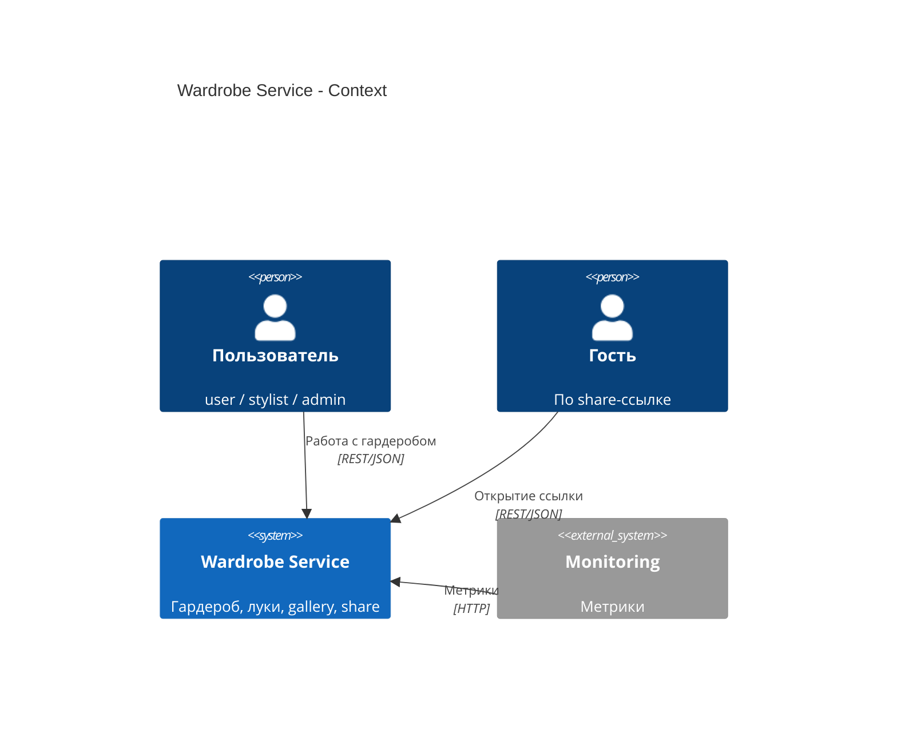
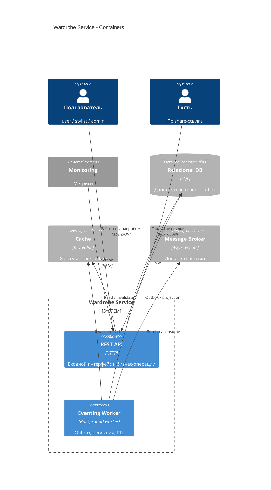
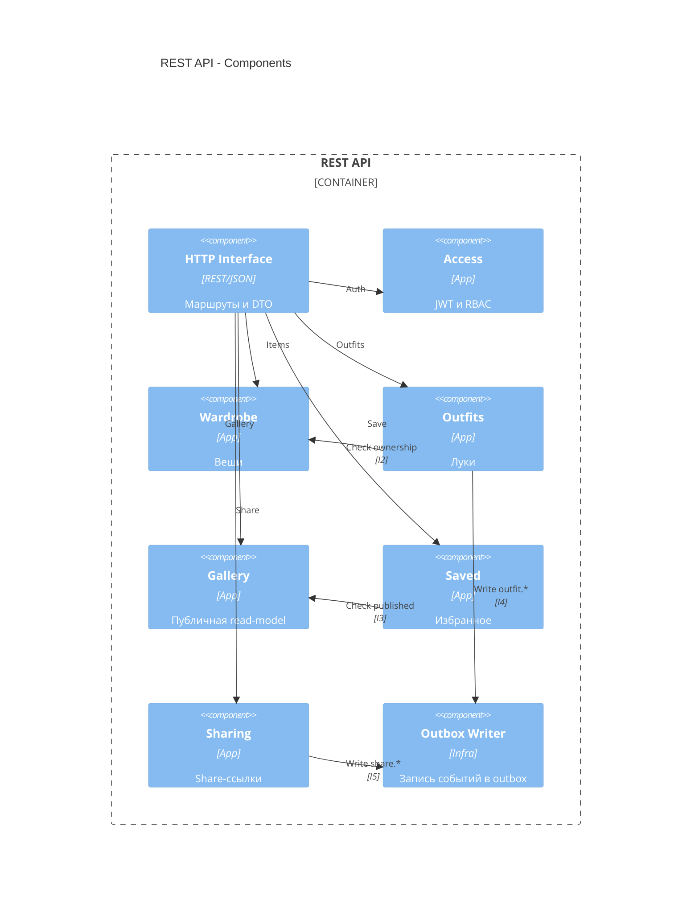

## 6. C4 диаграммы

### 6.1 C4 Context

```mermaid
C4Context
    title Wardrobe Service - Context
    UpdateLayoutConfig($c4ShapeInRow="3")

    Person(user, "Пользователь", "user / stylist / admin")
    Person(guest, "Гость", "По share-ссылке")
    System(wardrobe, "Wardrobe Service", "Гардероб, луки, gallery, share")
    System_Ext(monitoring, "Monitoring", "Метрики")

    Rel_R(user, wardrobe, "Работа с гардеробом", "REST/JSON")
    Rel_R(guest, wardrobe, "Открытие ссылки", "REST/JSON")
    Rel_U(monitoring, wardrobe, "Метрики", "HTTP")
    UpdateRelStyle(user, wardrobe, $offsetY="-25")
    UpdateRelStyle(guest, wardrobe, $offsetY="25")
```
### 6.2 C4 Container

```mermaid
C4Container
    title Wardrobe Service - Containers
    UpdateLayoutConfig($c4ShapeInRow="3", $c4BoundaryInRow="1")

    Person(user, "Пользователь", "user / stylist / admin")
    Person(guest, "Гость", "По share-ссылке")
    System_Ext(monitoring, "Monitoring", "Метрики")

    System_Boundary(ws, "Wardrobe Service") {
        Container(api, "REST API", "HTTP", "Входной интерфейс и бизнес-операции")
        Container(worker, "Eventing Worker", "Background worker", "Outbox, проекции, TTL")
    }

    ContainerDb_Ext(db, "Relational DB", "SQL", "Данные, read-model, outbox")
    Container_Ext(cache, "Cache", "Key-value", "Gallery и share lookup")
    Container_Ext(broker, "Message Broker", "Async events", "Доставка событий")

    Rel_R(user, api, "Работа с гардеробом", "REST/JSON")
    Rel_R(guest, api, "Открытие ссылки", "REST/JSON")
    Rel_U(monitoring, api, "Scrape", "HTTP")

    Rel_D(api, db, "R/W")
    Rel_R(api, cache, "Read / invalidate")
    Rel_D(worker, db, "Outbox / projection")
    Rel_R(worker, broker, "Publish / consume")
    Rel_U(worker, cache, "Invalidate cache")
```

### 6.3 C4 Component

```mermaid
C4Component
    title REST API - Components
    UpdateLayoutConfig($c4ShapeInRow="3", $c4BoundaryInRow="1")

    Container_Boundary(service, "REST API") {
        Component(http, "HTTP Interface", "REST/JSON", "Маршруты и DTO")
        Component(access, "Access", "App", "JWT и RBAC")
        Component(wardrobeCmp, "Wardrobe", "App", "Вещи")
        Component(outfits, "Outfits", "App", "Луки")
        Component(gallery, "Gallery", "App", "Публичная read-model")
        Component(saved, "Saved", "App", "Избранное")
        Component(sharing, "Sharing", "App", "Share-ссылки")
        Component(outbox, "Outbox Writer", "Infra", "Запись событий в outbox")
    }

    Rel_R(http, access, "Auth")
    Rel_D(http, outfits, "Outfits")
    Rel_D(http, wardrobeCmp, "Items")
    Rel_D(http, gallery, "Gallery")
    Rel_D(http, saved, "Save")
    Rel_D(http, sharing, "Share")

    Rel_R(outfits, wardrobeCmp, "Check ownership", "I2")
    Rel_L(saved, gallery, "Check published", "I3")

    Rel_D(outfits, outbox, "Write outfit.*", "I4")
    Rel_R(sharing, outbox, "Write share.*", "I5")

    UpdateRelStyle(http, outfits, $offsetX="-20", $offsetY="-10")
    UpdateRelStyle(http, wardrobeCmp, $offsetX="20", $offsetY="-10")
    UpdateRelStyle(http, gallery, $offsetX="-20", $offsetY="-10")
    UpdateRelStyle(http, saved, $offsetX="20", $offsetY="-10")
```