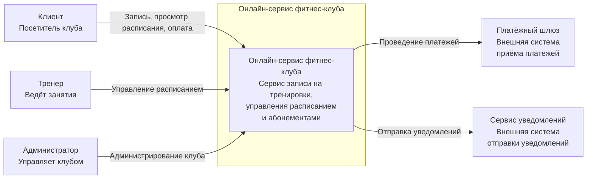
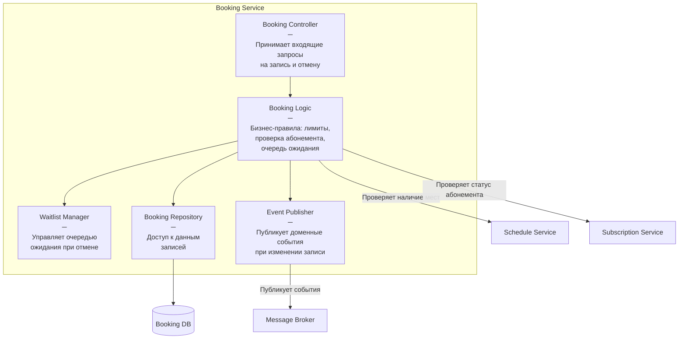
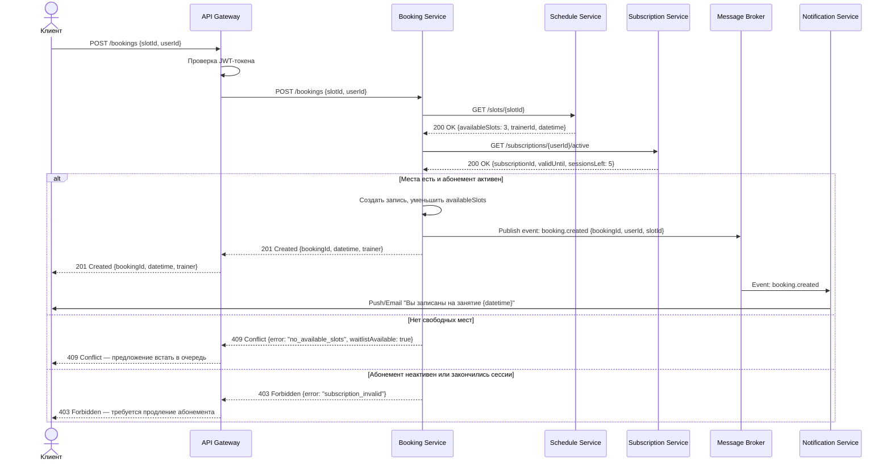

## Онлайн-сервис для фитнес-клуба

---

## 1. Описание системы

Онлайн-сервис для фитнес-клуба. 
Пользователи могут создать личный кабинет, видеть расписание тренировок, записываться на них,
а так же просматривать, на что они уже записались. Может купить абонемент.

Тренеры добавляют свои тренировки и могут смотреть информацию о предстоящих (например, сколько человек записались).

Администраторы контролируют работу всего клуба.

**Роли в системе:**
- **Клиент** – пользователь, клиент клуба
- **Тренер** – ведёт занятия, управляет своим расписанием
- **Администратор** – управляет клубом, тренерами, залами, абонементами

---

## 2. Декомпозиция системы

### 2.1 Декомпозиция по функциям 

| Компонент | Зона ответственности |
|---|---|
| **Auth Service** | Регистрация, аутентификация, выдача токенов, управление ролями |
| **User Service** | Профили пользователей, личный кабинет, история записей |
| **Schedule Service** | Расписание занятий, управление слотами, залами и тренерами |
| **Booking Service** | Запись на тренировки, отмена, ожидание освободившегося места |
| **Subscription Service** | Абонементы: создание, активация, заморозка, истечение |
| **Payment Service** | Приём оплаты, возвраты, интеграция с платёжным шлюзом |
| **Notification Service** | Email/Push-уведомления: напоминания, подтверждения, отмены |
| **API Gateway** | Единая точка входа, маршрутизация, авторизация запросов |

### 2.2 Декомпозиция по ролям 

| Роль | Доступные функции |
|---|---|
| **Клиент** | Просмотр расписания, запись на занятие, отмена записи, просмотр абонемента, оплата, личный кабинет |
| **Тренер** | Управление своим расписанием, просмотр списка записавшихся клиентов, отметка посещаемости |
| **Администратор** | Управление пользователями и тренерами, управление залами, создание типов абонементов, просмотр статистики, ручная корректировка расписания |

### 2.3 Обоснование соблюдения SRP

Каждый сервис имеет свою конкретную зону ответственности и одну причину для изменения:

- **Auth Service** меняется только при изменении механизма аутентификации (например, переход на OAuth2, добавление 2FA)
- **Schedule Service** меняется только при изменении логики расписания и управления залами
- **Booking Service** меняется только при изменении бизнес-правил записи (очередь ожидания, лимиты)
- **Payment Service** меняется только при смене платёжного шлюза или добавлении новых методов оплаты
- **Notification Service** меняется только при изменении каналов и шаблонов уведомлений

---

## 3. Архитектурные диаграммы C4

### 3.1 Уровень 1 — Контекстная диаграмма (System Context)



### 3.2 Уровень 3 — Компонентная диаграмма контейнера Booking Service



---

## 4. Sequence – гистограмма

### Сценарий: Клиент записывается на групповое занятие



---

## 5. Интерфейсы взаимодействия и контракты

### 5.1 Типы взаимодействий

| Взаимодействие                          | Тип | Протокол | Обоснование |
|-----------------------------------------|---|---|---|
| Клиент –> API Gateway                   | Синхронный | REST/HTTPS | Пользователь ждёт немедленного ответа |
| Booking Service –> Schedule Service     | Синхронный | REST/HTTPS | Нужен актуальный ответ перед записью |
| Booking Service –> Subscription Service | Синхронный | REST/HTTPS | Нужна проверка в реальном времени |
| Booking Service –> Message Broker       | Асинхронный | AMQP (RabbitMQ) | Результат не нужен для завершения записи, не блокирует ответ |
| Message Broker –> Notification Service  | Асинхронный | AMQP (RabbitMQ) | Отправка уведомлений не требует немедленности |
| Payment Service –> Платёжный шлюз       | Синхронный | REST/HTTPS | Результат платежа нужен мгновенно |

### 5.2 Контракты интерфейсов

#### POST /bookings — Создать запись на занятие

**Запрос:**
```json
{
  "userId": "uuid",
  "classId": "uuid"
}
```

**Успешный ответ (201 Created):**
```json
{
  "bookingId": "uuid",
  "classId": "uuid",
  "datetime": "2025-09-15T10:00:00Z",
  "status": "confirmed"
}
```

**Ошибки:**

| HTTP-код | error                  | Описание |
|---|------------------------|---|
| 400 | `invalid_request`      | Отсутствуют обязательные поля |
| 401 | `unauthorized`         | Токен отсутствует или невалиден |
| 403 | `subscription_invalid` | Абонемент неактивен или закончились сессии |
| 404 | `class_not_found`      | Занятие не найдено или было отменено |
| 409 | `no_available_slots`   | Нет свободных мест на занятии |


---

#### GET /slots/{slotId} — Получить информацию о слоте

**Успешный ответ (200 OK):**
```json
{
  "slotId": "uuid",
  "type": "group",
  "datetime": "2026-026-16T10:00:00Z",
  "duration": 60,
  "trainerId": "uuid",
  "hallId": "uuid",
  "totalSeats": 15,
  "availableSeats": 3
}
```

**Ошибки:**

| HTTP-код | error | Описание |
|---|---|---|
| 404 | `class_not_found` | Занятие не найдено или было отменено |

---

#### GET /subscriptions/{userId}/active — Проверить активный абонемент

**Успешный ответ (200 OK):**
```json
{
  "subscriptionId": "uuid",
  "type": "monthly",
  "validUntil": "2026-06-06",
  "sessionsLeft": 5,
  "status": "active"
}
```

**Ошибки:**

| HTTP-код | error | Описание |
|---|---|---|
| 404 | `no_active_subscription` | Нет активного абонемента |

---

#### Event: booking.created (RabbitMQ)

**Payload:**
```json
{
  "eventType": "booking.created",
  "bookingId": "uuid",
  "userId": "uuid",
  "slotId": "uuid",
  "datetime": "2026-09-16T10:00:00Z",
  "occurredAt": "2026-09-06T08:23:11Z"
}
```

---

## 6. Анализ связности компонентов

### 6.1 Текущая связность

| Зависимость                                 | Тип связности | Проблема                                                   |
|---------------------------------------------|---|------------------------------------------------------------|
| Booking –> Schedule Service                 | Temporal coupling (синхронный вызов) | Если Schedule Service недоступен, то запись невозможна     |
| Booking –> Subscription Service             | Temporal coupling (синхронный вызов) | Если Subscription Service недоступен, то запись невозможна |
| Notification Service –> данные пользователя | Данные передаются через события | Низкая — сервис получает нужное из события                 |
| API Gateway –> все сервисы                  | Routing coupling | Gateway знает об адресах всех сервисов                     |

### 6.2 Предложения по снижению связности

**1. Кэширование данных расписания в Booking Service**

Сейчас Booking Service при каждой записи синхронно спрашивает Schedule Service: "есть ли свободные места?". 
Если Schedule Service в этот момент недоступен и запись падает с ошибкой, хотя технически места могут быть. 
Чтобы это исправить, Booking Service может подписаться на события class.updated от Schedule Service и хранить у себя 
актуальное состояние занятий. Тогда при записи он обращается к своим данным, а не делает синхронный запрос к соседнему сервису.

**2. Явная обработка недоступности зависимых сервисов**

Если Schedule Service или Subscription Service не отвечает, запрос на запись сейчас просто зависает до таймаута. 
Лучше явно обрабатывать такую ситуацию: при отсутствии ответа сразу возвращать клиенту понятное сообщение об ошибке,
например, "сервис временно недоступен, попробуйте позже". Это снижает зависимость от доступности соседних сервисов и 
улучшает поведение системы при сбоях.

**3. Переход к событийной модели для Subscription Service**

Вместо синхронного запроса `GET /subscriptions/{userId}/active` — подписаться на события `subscription.activated` / `subscription.expired` 
и хранить в Booking Service актуальный статус абонементов. Тогда при записи Booking Service проверяет абонемент по 
своим данным, не обращаясь к Subscription Service напрямую.

**4. Динамическая адресация сервисов вместо фиксированной**

Сейчас API Gateway знает адреса всех сервисов заранее, так как они прописаны в конфигурации. Если сервис переехал или запустился 
новый экземпляр, нужно вручную обновлять конфиг. Лучше, чтобы сервисы сами регистрировали свой адрес при запуске, а Gateway 
запрашивал актуальный адрес в момент обращения. Это снижает связность и упрощает управление при росте системы.
### 6.3 Итоговая оценка связности

| Компонент | Связность до | Связность после |
|---|---|---|
| Booking Service | Высокая (2 синхронных зависимости) | Низкая (события + кэш) |
| Notification Service | Низкая | Низкая (без изменений) |
| API Gateway | Средняя | Низкая (Service Discovery) |
| Schedule Service | Средняя | Низкая (публикует события) |

---

## 7. Итог

В ходе работы была выполнена декомпозиция онлайн-сервиса фитнес-клуба:

- По функциям: выделено 8 сервисов с чёткой зоной ответственности, каждый следует SRP
- По ролям: определены права и сценарии для клиента, тренера и администратора
- Построены диаграммы C4 (context, component для Booking Service, sequence для сценария записи на занятие)
- Определены контракты для ключевых API-методов и событий
- Проведён анализ связности и предложены способы её снижения