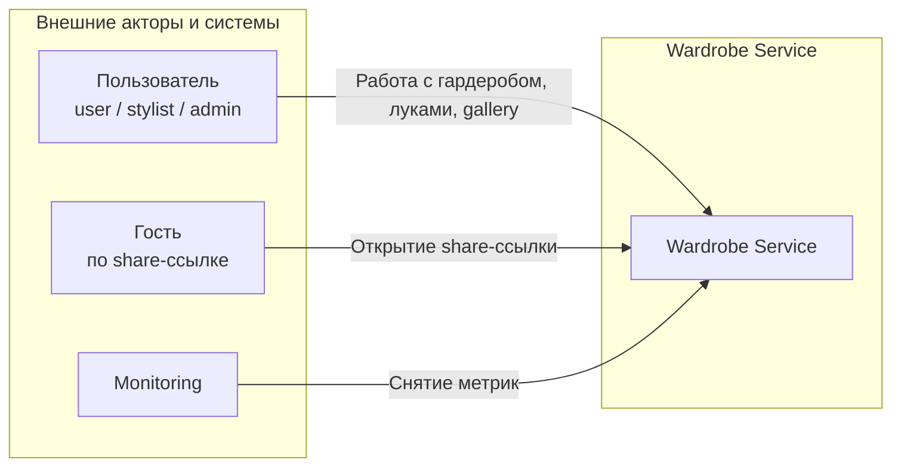
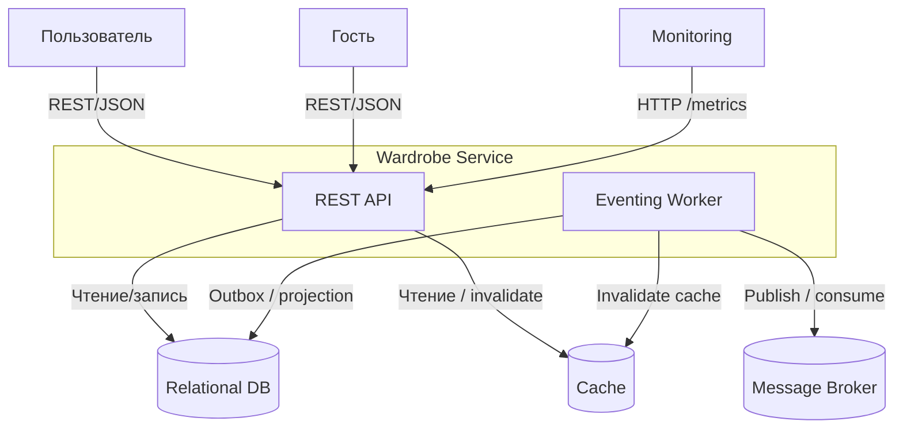
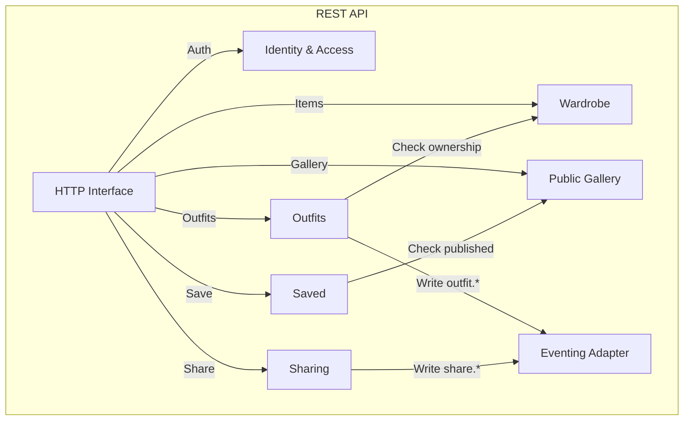
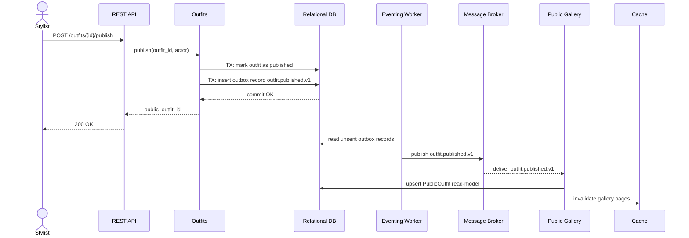

# *Лабораторная работа №1*. Wardrobe-Service

## 1. Система и границы

**Wardrobe Service** - backend-сервис для персонального гардероба и публикации луков. Сервис:
- хранит вещи пользователя (`WardrobeItem`) и приватные луки (`Outfit`);
- позволяет стилисту публиковать свои луки в публичной галерее;
- позволяет другим пользователям сохранять опубликованные луки в избранное (`SavedPublicOutfit`);
- позволяет владельцу выпускать share-ссылки с ограниченным временем жизни;
- поддерживает асинхронные проекции и инвалидацию кэша через доменные события.

Границы системы:
- внутри системы: бизнес-логика предметной области, политика доступа, публикация событий, построение read-model;
- вне системы: авторизованный пользователь, гость по share-ссылке, мониторинг, реляционная БД, кэш, брокер сообщений.

> Веб- и мобильный клиенты не выделяются как отдельные архитектурные компоненты, потому что на уровне этой лабораторной они не влияют на backend-декомпозицию.  
> Роли `user`, `stylist`, `admin` учитываются в политике доступа, а не как отдельные контейнеры или отдельные акторы на C4 Context.

> Сохранение чужого опубликованного лука трактуется как `SavedPublicOutfit`, а не как копирование чужих вещей в личный гардероб. Так сохраняется инвариант: приватный `Outfit` всегда состоит только из вещей владельца.

## 2. Декомпозиция

### 2.1 По доменам и данным

1. **Identity & Access**
- Сущности: `User`, `Role`, `AuthClaims`
- Ответственность: аутентификация, выдача claims, проверка ролей и ownership

2. **Wardrobe**
- Сущности: `WardrobeItem`
- Ответственность: CRUD вещей владельца, списки и карточки вещей

3. **Outfits**
- Сущности: `Outfit`, `OutfitItem`
- Ответственность: создание и изменение приватных луков, проверка состава лука, смена статуса публикации

4. **Public Gallery**
- Сущности: `PublicOutfit`
- Ответственность: чтение опубликованных луков и поддержание публичной read-model

5. **Saved**
- Сущности: `SavedPublicOutfit`
- Ответственность: сохранить или удалить опубликованный лук из избранного

6. **Sharing**
- Сущности: `ShareLink`
- Ответственность: выпуск share-ссылки, просмотр по токену, политика TTL

7. **Eventing**
- Сущности: `OutboxEvent`
- Ответственность: надежная публикация доменных событий и асинхронная доставка вторичных эффектов

### 2.2 По ролям

| Роль      | Разрешенные действия                                                              |
|-----------|-----------------------------------------------------------------------------------|
| `user`    | CRUD своих вещей и луков, просмотр галереи, save/unsave, просмотр по share-ссылке |
| `stylist` | все из `user` + публикация и снятие с публикации своих луков                      |
| `admin`   | все из `stylist` + изменение ролей пользователей                                  |

Ролевое разбиение отвечает за политику доступа, а доменное - за бизнес-границы и данные.

## 3. SRP и архитектурные компоненты

Ниже перечислены компоненты, через которые реализована доменная декомпозиция. У каждого компонента одна причина изменения.

| Компонент           | Соответствует домену                    | Единственная ответственность                              | Причина изменения                                     |
|---------------------|-----------------------------------------|-----------------------------------------------------------|-------------------------------------------------------|
| `REST API`          | технический адаптер поверх всех доменов | HTTP-маршруты, DTO, единый формат ответов и ошибок        | меняется публичный API-контракт                       |
| `Identity & Access` | `Identity & Access`                     | аутентификация и авторизация                              | меняются роли, claims, правила доступа                |
| `Wardrobe`          | `Wardrobe`                              | управление вещами владельца                               | меняется модель вещей или правила их жизненного цикла |
| `Outfits`           | `Outfits`                               | управление приватными луками и решением publish/unpublish | меняются правила состава лука или публикации          |
| `Public Gallery`    | `Public Gallery`                        | публичная read-model и сценарии чтения                    | меняется форма публичного представления лука          |
| `Saved`             | `Saved`                                 | избранное из публичной галереи                            | меняется логика save/unsave                           |
| `Sharing`           | `Sharing`                               | share-ссылки и TTL                                        | меняются правила шаринга и срока жизни ссылки         |
| `Eventing`          | `Eventing`                              | outbox, публикация событий и async-обработчики            | меняются event-контракты или политика доставки        |

Таким образом, SRP соблюден не по слоям "handlers/services/repositories", а по устойчивым бизнес-компонентам, которые напрямую соответствуют декомпозиции из раздела 2.

## 4. Интерфейсы и типы взаимодействий

На уровне лабораторной фиксируются **роли взаимодействий**, а не конкретные продукты. Поэтому в схемах используются обобщения `Relational DB`, `Cache`, `Message Broker`: архитектурно важен тип зависимости, а не название технологии.

| ID   | Между кем                                   | Тип         | Формат                      | Почему выбран именно этот тип                                            |
|------|---------------------------------------------|-------------|-----------------------------|--------------------------------------------------------------------------|
| `I1` | Авторизованный пользователь -> `REST API`   | синхронный  | REST/HTTP + JSON            | пользовательскому сценарию нужен немедленный ответ                       |
| `I2` | `Outfits` -> `Wardrobe`                     | синхронный  | внутренний query-контракт   | при создании и публикации лука нужно сразу проверить ownership вещей     |
| `I3` | `Saved` -> `Public Gallery`                 | синхронный  | внутренний query-контракт   | сохранять можно только уже опубликованный лук                            |
| `I4` | `Outfits` -> `Eventing` -> `Public Gallery` | асинхронный | доменное событие            | публикация не должна ждать обновления галереи                            |
| `I5` | `Sharing` -> `Eventing` -> `Sharing`        | асинхронный | отложенное доменное событие | истечение TTL должно происходить независимо от пользовательского запроса |

## 5. Контракты взаимодействия

Ниже детализированы контракты именно для интерфейсов `I1`-`I5` из раздела 4.

### 5.1 Единый формат ошибок для `I1`

```json
{
  "code": "bad_request|unauthorized|forbidden|not_found|conflict|unprocessable_entity|internal_error",
  "message": "human readable message",
  "details": {},
  "request_id": "uuid"
}
```

Соответствие `HTTP status` и `code`:

| HTTP  | `code`                 | Когда возникает                                                                          |
|-------|------------------------|------------------------------------------------------------------------------------------|
| `400` | `bad_request`          | некорректный JSON, обязательные поля не переданы                                         |
| `401` | `unauthorized`         | токен отсутствует или невалиден                                                          |
| `403` | `forbidden`            | роль или ownership не позволяют выполнить операцию                                       |
| `404` | `not_found`            | сущность не найдена, либо share-token уже истек                                          |
| `409` | `conflict`             | операция дублирует текущее состояние                                                     |
| `422` | `unprocessable_entity` | нарушен бизнес-инвариант                                                                 |
| `500` | `internal_error`       | непредвиденная ошибка или panic; детали не раскрываются, инцидент ищется по `request_id` |

Здесь `code` и `HTTP status` находятся в отношении "один к одному", поэтому неоднозначности между списками ошибок нет.

### 5.2 Контракт `I1.1` - publish outfit

`POST /outfits/{outfit_id}/publish`

Кто вызывает:
- `stylist`, если он владелец лука;
- `admin`, если публикует от имени любого пользователя.

Почему синхронно:
- пользователю нужен немедленный ответ о том, что публикация принята;
- в ответе возвращается `public_outfit_id`, с которым дальше работают `Public Gallery` и `Saved`.

Запрос:

```http
POST /outfits/4f0f4cc3-7b40-4df1-9d12-6737c03f95d2/publish
Authorization: Bearer <jwt>
X-Request-Id: 2bfbef2a-39e0-4c7b-b568-f64d8ec2435d
```

Успешный ответ:

```json
{
  "outfit_id": "4f0f4cc3-7b40-4df1-9d12-6737c03f95d2",
  "public_outfit_id": "2dfe80d3-8198-4bca-9d07-7ac4cba5d878",
  "status": "published"
}
```

Ошибки:

| HTTP  | `code`                 | Когда возникает                                      |
|-------|------------------------|------------------------------------------------------|
| `401` | `unauthorized`         | нет валидного JWT                                    |
| `403` | `forbidden`            | роль не `stylist/admin` или пользователь не владелец |
| `404` | `not_found`            | `Outfit` не существует                               |
| `409` | `conflict`             | лук уже опубликован                                  |
| `422` | `unprocessable_entity` | лук пустой или нарушен доменный инвариант            |
| `500` | `internal_error`       | непредвиденная ошибка                                |

### 5.3 Контракт `I1.2` - save public outfit

`POST /gallery/{public_outfit_id}/save`

Кто вызывает:
- любой авторизованный пользователь.

Почему синхронно:
- пользователь должен сразу получить результат "сохранено / не сохранено";
- операция меняет пользовательское состояние, поэтому откладывать ее нет смысла.

Запрос:

```http
POST /gallery/2dfe80d3-8198-4bca-9d07-7ac4cba5d878/save
Authorization: Bearer <jwt>
X-Request-Id: 4934bf6d-f5a5-49bb-9e55-5bb37b41b4d7
```

Успешный ответ:

```json
{
  "saved_id": "a9f34ee2-a533-4d89-ae5f-c31b93fbfa90",
  "public_outfit_id": "2dfe80d3-8198-4bca-9d07-7ac4cba5d878",
  "status": "saved"
}
```

Ошибки:

| HTTP  | `code`           | Когда возникает                                        |
|-------|------------------|--------------------------------------------------------|
| `401` | `unauthorized`   | нет валидного JWT                                      |
| `404` | `not_found`      | `PublicOutfit` не существует или уже снят с публикации |
| `409` | `conflict`       | этот лук уже сохранен пользователем                    |
| `500` | `internal_error` | непредвиденная ошибка                                  |

### 5.4 Контракт `I2` - внутренний sync query `Outfits -> Wardrobe`

Назначение:
- `Outfits` не должен знать полную схему `WardrobeItem`, но должен проверить, что все вещи принадлежат владельцу и доступны для включения в лук.

Запрос:

```json
{
  "owner_id": "d9c3b2aa-d3a1-4cf0-a377-c4ad89a8ab51",
  "item_ids": [
    "08f1ed3c-93b8-4905-89ab-8d3a9f8a85bf",
    "9ad337aa-854f-4de1-81d2-94fd8d0f0bb0"
  ]
}
```

Ответ:

```json
{
  "items": [
    {
      "item_id": "08f1ed3c-93b8-4905-89ab-8d3a9f8a85bf",
      "owner_id": "d9c3b2aa-d3a1-4cf0-a377-c4ad89a8ab51",
      "is_active": true
    }
  ]
}
```

Ошибки контракта:
- `item_not_found` - хотя бы одна вещь не существует;
- `item_not_owned` - хотя бы одна вещь принадлежит другому пользователю;
- `item_inactive` - вещь нельзя использовать в луке.

### 5.5 Контракт `I3` - внутренний sync query `Saved -> Public Gallery`

Назначение:
- `Saved` работает только с публичной read-model и не зависит от приватных таблиц `Outfits`.

Запрос:

```json
{
  "public_outfit_id": "2dfe80d3-8198-4bca-9d07-7ac4cba5d878"
}
```

Ответ:

```json
{
  "public_outfit_id": "2dfe80d3-8198-4bca-9d07-7ac4cba5d878",
  "author_id": "d9c3b2aa-d3a1-4cf0-a377-c4ad89a8ab51",
  "status": "published"
}
```

Ошибки контракта:
- `public_outfit_not_found` - лук отсутствует в публичной read-model;
- `public_outfit_unavailable` - лук уже снят с публикации.

### 5.6 Контракт `I4` - событие `outfit.published.v1`

Общий envelope:

```json
{
  "event_id": "uuid",
  "event_type": "outfit.published.v1",
  "occurred_at": "2026-04-02T10:15:00Z",
  "producer": "outfits",
  "trace_id": "uuid",
  "payload": {}
}
```

Payload:

```json
{
  "outfit_id": "4f0f4cc3-7b40-4df1-9d12-6737c03f95d2",
  "public_outfit_id": "2dfe80d3-8198-4bca-9d07-7ac4cba5d878",
  "author_id": "d9c3b2aa-d3a1-4cf0-a377-c4ad89a8ab51",
  "published_at": "2026-04-02T10:15:00Z"
}
```

Поведение при ошибках:
- доставка `at-least-once`;
- `Public Gallery` обязан быть идемпотентным по `event_id`;
- при ошибке обработки событие ретраится;
- после исчерпания лимита попыток попадает в `DLQ`;
- синхронного ответа издателю нет, потому что это async-контракт.

### 5.7 Контракт `I5` - события `share.created.v1` и `share.expired.v1`

`share.created.v1`:

```json
{
  "event_id": "uuid",
  "event_type": "share.created.v1",
  "occurred_at": "2026-04-02T10:20:00Z",
  "producer": "sharing",
  "trace_id": "uuid",
  "payload": {
    "share_id": "4308fbd5-6385-47af-871d-6a2e4f18b4f4",
    "outfit_id": "4f0f4cc3-7b40-4df1-9d12-6737c03f95d2",
    "token": "opaque-token",
    "expires_at": "2026-04-03T10:20:00Z"
  }
}
```

`share.expired.v1`:

```json
{
  "event_id": "uuid",
  "event_type": "share.expired.v1",
  "occurred_at": "2026-04-03T10:20:00Z",
  "producer": "eventing",
  "trace_id": "uuid",
  "payload": {
    "share_id": "4308fbd5-6385-47af-871d-6a2e4f18b4f4",
    "token": "opaque-token"
  }
}
```

Гарантия контракта:
- `share.expired.v1` должен появиться не раньше `expires_at`;
- конкретный механизм реализации не фиксируется: это может быть delayed message, scheduler или другая инфраструктурная реализация;
- для архитектуры важен сам контракт истечения TTL, а не выбранный продукт.

## 6. C4 диаграммы

### 6.1 C4 Context



На context-диаграмме роли `user`, `stylist`, `admin` не разнесены на отдельных акторов намеренно: они взаимодействуют с одной и той же системой одинаковым способом, различаются только политикой доступа.

### 6.2 C4 Container



Container-диаграмма показывает, как система разложена на крупные исполняемые части и как они взаимодействуют с внешней инфраструктурой. Здесь как раз уместно показывать БД, кэш, брокер и monitoring.

### 6.3 C4 Component



Component-диаграмма теперь показывает только **внутренности контейнера `REST API`**. Асинхронная обработка, брокер, кэш и БД вынесены на container-уровень выше. Компоненты названы так же, как в декомпозиции и в анализе связности, чтобы не приходилось догадываться о соответствии разделов. Это уменьшает число пересечений и при этом сохраняет правильную семантику C4: `Container` отвечает на вопрос "из каких исполняемых частей состоит система", а `Component` - "из каких частей состоит один выбранный контейнер".

## 7. Диаграмма последовательностей

Сценарий: **stylist публикует лук, после чего он появляется в public gallery**



Все участники диаграммы уже определены в декомпозиции и в C4-диаграммах, поэтому здесь не появляется новых сущностей "из воздуха".

## 8. Анализ связности

### 8.1 Анализ по парам компонентов

| Пара компонентов                        | Почему связаны                                                                                   | Уровень связности | Риск                                                                                                                 |
|-----------------------------------------|--------------------------------------------------------------------------------------------------|-------------------|----------------------------------------------------------------------------------------------------------------------|
| `Outfits -> Wardrobe`                   | лук состоит из вещей владельца, поэтому `Outfits` обязан проверить ownership и доступность вещей | средняя           | если `Outfits` начнет зависеть от полной схемы `WardrobeItem`, любое изменение модели вещи потянет изменения в луках |
| `Saved -> Public Gallery`               | сохранить можно только опубликованный лук                                                        | средняя           | если `Saved` пойдет в приватные таблицы `Outfits`, появится лишняя зависимость от private-модели                     |
| `Outfits -> Eventing -> Public Gallery` | публикация должна сделать лук видимым в галерее                                                  | средняя           | если обновлять галерею синхронно, появится temporal coupling и рост latency                                          |
| `Sharing -> Eventing`                   | истечение share-ссылки происходит после завершения пользовательского запроса                     | слабая            | появится зависимость от конкретной инфраструктуры TTL, если зафиксировать реализацию слишком рано                    |
| `Identity & Access -> остальные домены` | почти каждая команда зависит от JWT claims и ownership-проверок                                  | слабая            | если проверки размазаны по handlers и use-case логике, политика доступа начнет дублироваться                         |
| `Public Gallery / Sharing -> Cache`     | gallery и share lookup требуют быстрых чтений                                                    | слабая            | строковая работа с ключами кэша приводит к ошибкам инвалидации и устаревшим данным                                   |

### 8.2 Как снижена связность

| Выявленный риск                                                 | Архитектурное решение                                                                 | Как это снижает связность                                                                      |
|-----------------------------------------------------------------|---------------------------------------------------------------------------------------|------------------------------------------------------------------------------------------------|
| `Outfits` может начать зависеть от полной модели `WardrobeItem` | использовать минимальный sync-контракт `I2: GetOwnedItems(item_ids, owner_id)`        | `Outfits` знает только стабильный набор полей, а не внутреннюю структуру `Wardrobe`            |
| публикация лука может синхронно зависеть от обновления галереи  | использовать `Outbox + I4: outfit.published.v1` и отдельную `PublicOutfit` read-model | публикация завершается после записи истины, а галерея обновляется независимо                   |
| `Saved` может зависеть от приватных таблиц `Outfits`            | использовать только `public_outfit_id` и sync-контракт `I3` к `Public Gallery`        | `Saved` связан только с публичной проекцией, а не с private-доменом                            |
| работа с TTL может привязать `Sharing` к конкретному продукту   | зафиксировать контракт `I5`, но не фиксировать технологию delayed delivery            | сохраняется архитектурный смысл без преждевременной привязки к RabbitMQ/cron и т.д.            |
| RBAC и ownership могут размазаться по коду                      | держать проверки в `Identity & Access` и в доменных use-case компонентах              | политика доступа сосредоточена в одном месте, а не дублируется в каждом handler                |
| строковые ключи кэша могут расползтись по системе               | использовать единый adapter для ключей и TTL-политик                                  | `Public Gallery` и `Sharing` зависят от одного кэш-контракта вместо набора строковых литералов |

### 8.3 Trade-offs

- `Public Gallery` и `Sharing` становятся **eventually consistent** относительно publish/share-команд.
- Появляется дополнительная инфраструктурная сложность: outbox, брокер сообщений, ретраи, DLQ.
- Эта сложность оправдана тем, что пользовательские команды перестают зависеть от всех вторичных эффектов синхронно.

## 9. Что измеряется

Для async-части важно наблюдать не только HTTP, но и движение событий:

- `request_id`, `trace_id`, `event_id` - для склейки REST-вызова и последующих async-эффектов;
- `http_requests_total`, `http_request_duration_seconds` - пользовательский вход;
- `outbox_unsent_total`, `outbox_publish_failures_total` - состояние `Eventing`;
- `event_processing_lag_seconds` - задержка от записи события до применения в `Public Gallery` или `Sharing`;
- `consumer_retries_total`, `dlq_total` - проблемы доставки и обработки;
- `cache_hits_total`, `cache_misses_total` - эффективность `Public Gallery` и `Sharing` при чтениях.
