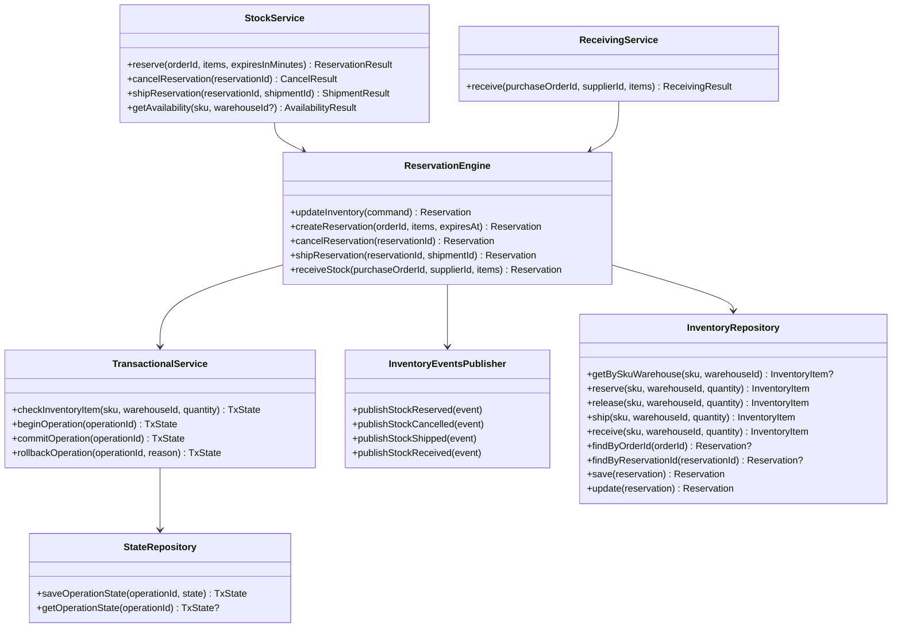
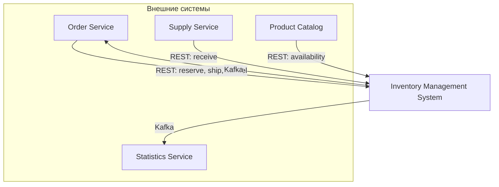
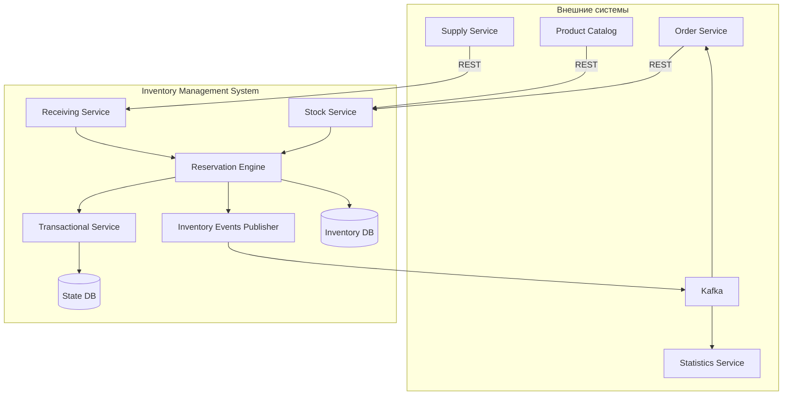
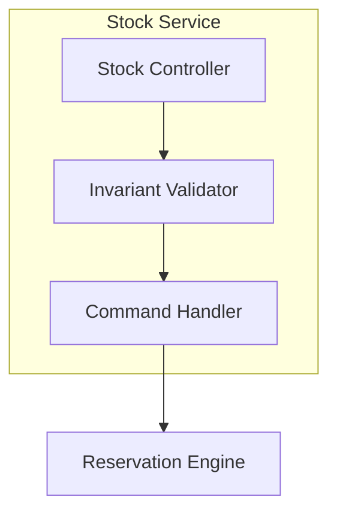
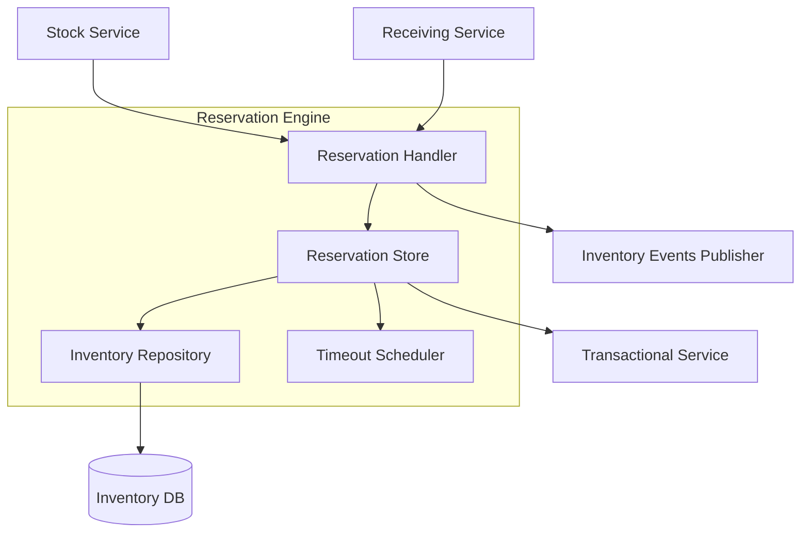
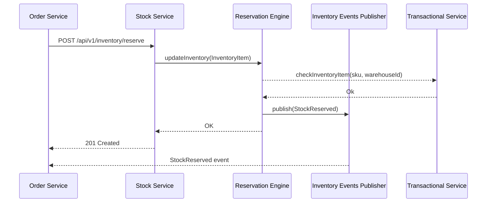

### В качестве проекта я выбрал Сервис управления запасами (4 проект).

## Декомпозиция:

### Декомпозиция по функциям:
- Stock Service - управление остатками
- Reservation Engine - управление резервированием и работа с бд
- Transactional Service - соблюдение транзакционности
- Receiving Service - управление приемом поставок
- Inventory Events Publisher - отправка сообщений внешним сервисам

### Декомпозиция по ролям:
- Order Service - Резервирует, списывает, отменяет резерв
- Supply Service - Инициирует приёмку товара
- Product Catalog - Запрашивает наличие товара
- Statistics Service - Потребляет события об изменениях запасов для статистики

### Почему соответствует SRP:

- Stock Service - Единая точка входа для всех операций с инвентарём
- Reservation Engine - Единственный компонент, который отвечает за работу с основной бд
- Receiving Service - Единственный компонент, который отвечает за приемку товара. Не влияет на резервирование
- Inventory Events Publisher - Единственный компонент, который отвечает за публикацию событий.
- Transactional Service - Единственный компонент, который отвечает за соблюдение транзакционности


## Интерфейсы и контракты взаимодействия:

### REST API
#### POST /api/v1/inventory/reserve — Резервирование товара
- Вход (Request Body):
```json
{
    "orderId": "uuid",
    "items": [
    {
        "sku": "SKU-12345",
        "quantity": 5,
        "warehouseId": "wh-01"
    }
    ],
    "expiresInMinutes": 30
}
```
- Выход (Response 201 Created):
```json
{
  "reservationId": "uuid",
  "orderId": "uuid",
  "status": "CONFIRMED",
  "reservedItems": [
    {
      "sku": "SKU-12345",
      "reservedQuantity": 5,
      "warehouseId": "wh-01"
    }
  ],
  "expiresAt": "2026-01-15T09:00:00Z",
  "createdAt": "2026-01-15T09:00:00Z"
}
```

- Ошибки:
  - 400	INVALID_REQUEST	Некорректные входные данные
  - 404	SKU_NOT_FOUND	Указанный SKU не существует
  - 409	INSUFFICIENT_STOCK	Недостаточно товара для резервирования
  - 409	DUPLICATE_RESERVATION	Резервирование для этого orderId уже существует
  - 422	WAREHOUSE_UNAVAILABLE	Указанный склад недоступен
  - 500	INTERNAL_ERROR	Внутренняя ошибка сервера

#### DELETE /api/v1/inventory/reserve/{reservationId} - Отмена резервирования
- Вход (Request Body): Нету

- Выход (Response 200 OK):
```json
{
  "reservationId": "uuid",
  "status": "CANCELLED",
  "releasedItems": [
    {
      "sku": "SKU-12345",
      "releasedQuantity": 5,
      "warehouseId": "wh-01"
    }
  ],
  "cancelledAt": "2026-01-15T09:00:00Z"
}
```

- Ошибки:
  - 404	RESERVATION_NOT_FOUND	Резервирование не найдено
  - 409	ALREADY_SHIPPED	Товар уже списан, отмена невозможна
  - 409	ALREADY_CANCELLED	Резервирование уже отменено


#### POST /api/v1/inventory/ship — Списание товара

- Вход (Request Body):
```json
{
  "reservationId": "uuid",
  "shipmentId": "ship-uuid"
}
```

- Выход (Response 200 OK):
```json
{
  "reservationId": "uuid",
  "shipmentId": "ship-uuid",
  "status": "SHIPPED",
  "shippedItems": [
    {
      "sku": "SKU-12345",
      "shippedQuantity": 5,
      "warehouseId": "wh-01"
    }
  ],
  "shippedAt": "2026-01-15T09:00:00Z"
}
```

- Ошибки:
    - 404	RESERVATION_NOT_FOUND	Резервирование не найдено
    - 409	RESERVATION_EXPIRED	Резервирование истекло
    - 409	ALREADY_SHIPPED	Товар уже списан

#### POST /api/v1/inventory/receive — Приёмка товара

- Вход (Request Body):
```json
{
  "supplierId": "supplier-uuid",
  "purchaseOrderId": "po-12345",
  "items": [
    {
      "sku": "SKU-12345",
      "quantity": 100,
      "warehouseId": "wh-01"
    }
  ]
}
```

- Выход (Response 201 Created):
```json
{
  "receivingId": "uuid",
  "purchaseOrderId": "po-12345",
  "status": "RECEIVED",
  "receivedItems": [
    {
      "sku": "SKU-12345",
      "receivedQuantity": 100,
      "warehouseId": "wh-01",
      "newAvailableQuantity": 150
    }
  ],
  "receivedAt": "2026-01-15T09:00:00Z"
}
```

- Ошибки:
  - 400	INVALID_REQUEST	Некорректные входные данные
  - 404	SKU_NOT_FOUND	Указанный SKU не существует
  - 409	PURCHASE_ORDER_ALREADY_RECEIVED	Заказ уже получен
  - 409	DUPLICATE_RECEIVING	Дублирование получения такого товара
  - 422	SUPPLIER_UNAVAILABLE	Указанный поставщик недоступен
  - 500	INTERNAL_ERROR	Внутренняя ошибка сервера

#### GET /api/v1/inventory/{sku}/availability — Проверка наличия
- Query Parameters:
  - warehouseId - опциональный фильтр по складу

- Выход (Response 200 OK):
```json
{
  "sku": "SKU-12345",
  "productName": "Товар XYZ",
  "warehouses": [
    {
      "warehouseId": "wh-01",
      "warehouseName": "Склад Эльфов",
      "availableQuantity": 45,
      "reservedQuantity": 10,
      "totalQuantity": 55,
      "incomingQuantity": 100
    },
    {
      "warehouseId": "wh-02",
      "warehouseName": "Склад Орков",
      "availableQuantity": 20,
      "reservedQuantity": 5,
      "totalQuantity": 25,
      "incomingQuantity": 0
    }
  ],
  "totalAvailable": 65,
  "totalReserved": 15
}
```

### Интерфейсы внутренних сервисов




 ### Контракты Kafka:

#### Типы событий
 - reserved
 - cancelled
 - shipped
 - received


#### Контракт события

```json
{
  "eventId": "uuid",
  "eventType": "StockReserved",
  "eventVersion": 1,
  "occurredAt": "2026-01-15T09:00:00Z",
  "producer": "inventory-events-publisher",
  "traceId": "uuid",
  "partitionKey": "SKU-12345:wh-01",
  "payload": {}
}
```


## Анализ связности компонентов

### Зависимости
- Stock Service: Reservation Engine
- Reservation Engine: Inventory Events Publisher, Inventory DB, Transactional Service
- Transactional Service: State DB
- Receiving Service: Reservation Engine
- Inventory Events Publisher: Kafka (publish)

### Оценка связности
- Reservation Engine - центральный компонент, все операции проходят через него, высокий Coupling
- Stock Service - отвечает за получение информации о товарах, особенно нагружен

### Решение по снижению связности
- Сделать из Reservation Engine отдельный микросервис со своей базой данных 
- Так же имеет смысл вынести в отдельный микросервис Stock Service

## C4 Схемы

### Context Diagram


### Container Diagram - Inventory Management System


### Component Diagram — Stock Service



### Component Diagram — Reservation Engine



## Диаграммы последовательностей

### Успешное резервирование товара

